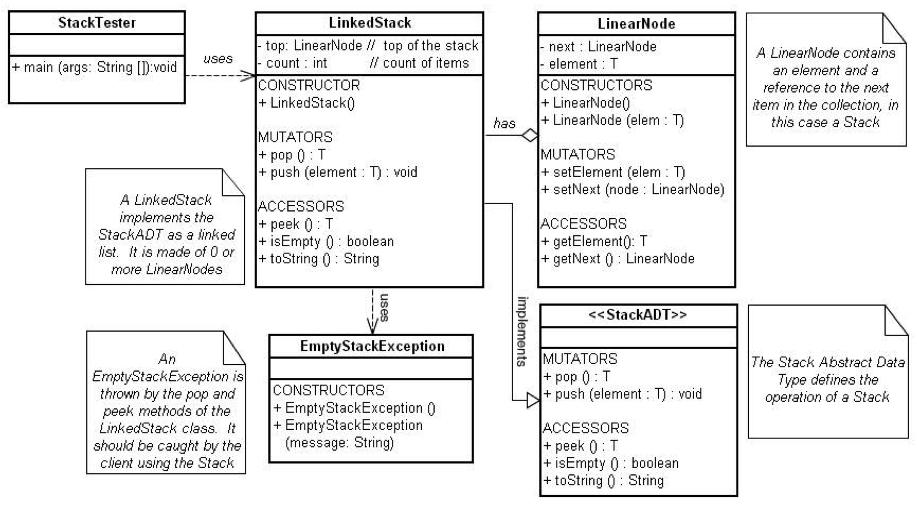

# Lab 3 Linked Stack
## Purpose
The purpose of this lab is to complete the implementation of a Linked Stack ADT
as described in the lab instructions below.  The Stack ADT was chosen because
the student is already familiar with stack operations. Additionally, the
successful student will gain significant insight into the use of generics.

## Evaluation
Students will be awarded up to 10 points for successfully completing this lab
as outlined below.

## Step 1: Design
As you begin your lab, study the UML Diagram, which will guide the roadmap
through the lab this week.


## Step 2: Obtain Starter Code
Clone this repository in your coding environment. You will see
5 Java source files in the repository directory.
* StackADT.java
* LinearNode.java
* LinkedStack.java
* StackTester.java
* EmptyStackException.java

You can compile these Java source files with the following command:
```
javac *.java
```

## Step 3: Run the StackTester Class
The main method is found in the `StackTester.java`. Run the file using the
following command:
```
java StackTester
```
You should see in the console "cba", which is being returned from a call to the
`toString()` method, not by `peek` or `pop`.

## Step 4: Implementing the pop()
Using your text as a reference, implement and test the `pop` method.
NOTE: We are using an `EmptyStackException`rather than the
`EmptyCollectionException`as shown in your text.

After getting your `LinkedStack` class to compile with your new `pop` method,
test the `pop` method by replacing the code in the main method with the
following code segment:
```Java
// Create an empty linked stack named ls
LinkedStack<Character> ls = new LinkedStack<Character>();

// Push several items onto the stack and print the
// contents with an implicit call to toString method

ls.push(new Character('a'));
ls.push(new Character('b'));
ls.push(new Character('c'));
System.out.println(ls);

// Popping the stack has the potential of throwing an
// exception, so place inside a try catch block

try {
  ls.pop();
  ls.pop();
  ls.pop();
  ls.pop();
} catch (EmptyStackException e) {
  System.out.println("Stack is empty");
}
```

## Step 5: peek()
Using the knowledge you gained by studying the `push` and `pop` methods,
write and test a `peek` method.
* Handwrite the code for your peek method on a piece of paper
  BEFORE you type it into your file.
* Call your instructor over and explain how your method works. Draw pictures to
  explain your method.

## Step 6: contains()
Implement and test the `contains` method.

## Step 7: Efficiency
Examine all of the current methods in the `LinkedStack` class and identify their efficiency categories.

## Step 8: Finish Up
When you have successfully answered all the lab questions, and written and
tested the `pop`, `peek`, and `contains` methods of the `LinkedStack` class, you are finished.

Add a "result.txt" with your answers to the questions, commit your changes, and push your changes to
github.
